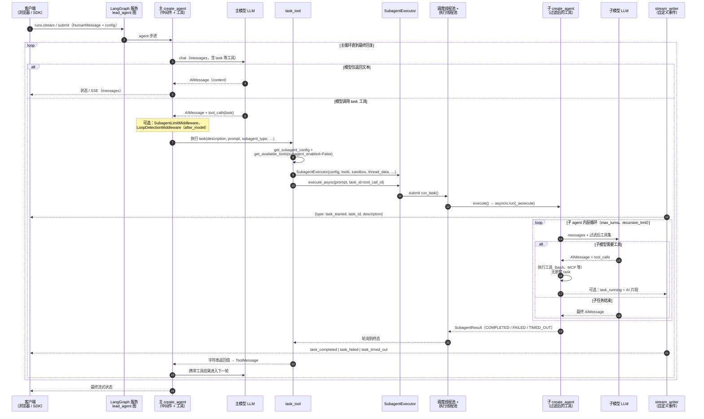

# 主 Agent → 子 Agent 时序说明

本文说明 **主 agent（lead）** 通过 **`task` 工具** 委派任务时的运行时链路。实现可参考：`tools/builtins/task_tool.py`、`subagents/executor.py`、`agents/lead_agent/agent.py`。

## 时序图

## 数据流简表

| 步骤 | 说明 |
|------|------|
| 1 | 主 LLM 发起 `task`，带上 `subagent_type`（`general-purpose` 或 `bash`）与 `prompt`。 |
| 2 | `task_tool` 构造 `SubagentExecutor`，继承父级 `sandbox` / `thread_data` / `thread_id`，子侧工具集去掉 `task`。 |
| 3 | 子 agent 在**后台线程池**中运行；`task_tool` **轮询**直至结束，同时通过 **自定义流事件** 推送给客户端。 |
| 4 | 子侧是独立的 `create_agent` + `astream`；结果汇总为一条 **ToolMessage** 回到主线程。 |
| 5 | 主 LLM 继续推理，可再次调工具或产出用户可见的最终回答。 |

## 关键源码位置

| 模块 | 路径 |
|------|------|
| `task` 工具 | `packages/harness/deerflow/tools/builtins/task_tool.py` |
| 子 agent 执行与线程池 | `packages/harness/deerflow/subagents/executor.py` |
| 内置子 agent 配置 | `packages/harness/deerflow/subagents/builtins/` |
| 主侧注册 `task` | `packages/harness/deerflow/tools/tools.py`、`agents/lead_agent/agent.py` |
| 子 agent 中间件（无 uploads） | `packages/harness/deerflow/agents/middlewares/tool_error_handling_middleware.py` → `build_subagent_runtime_middlewares` |
| 截断过量 `task` 调用 | `packages/harness/deerflow/agents/middlewares/subagent_limit_middleware.py` |

## 如何渲染时序图

- **GitHub / GitLab**：多数版本在 Markdown 预览中支持 Mermaid。
- **VS Code**：安装 Mermaid 预览类扩展，或将代码块粘贴到 [mermaid.live](https://mermaid.live)。
- **MkDocs / Docusaurus**：若对外发布文档，需启用 Mermaid 插件。
